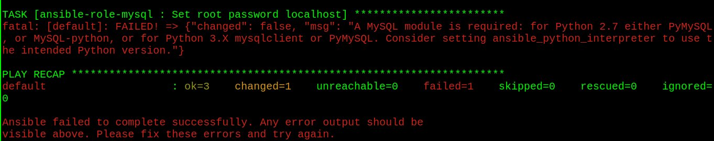
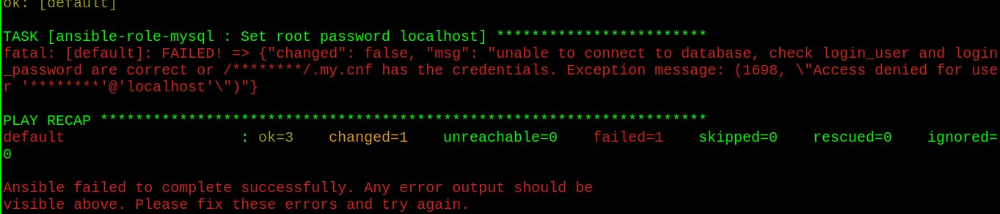

# Provisionador Ansible

O provisionador Ansible do Vagrant permite que você provisione a máquina convidada usando playbooks ansible ao executar `ansible-playbook` do hospedeiro Vagrant.

Para que você consiga fazer o provisionamento com o Ansible, instale o ansible em sua máquina hospedeira.

O Ansible é uma ferramenta de gestão de configuração, que permite a automação das tarefas de gerenciamento de hosts, seja Linux, Windows ou dispositivos de rede, atualização de sistemas operacionais, instalação de softwares, criação de usuário, gerenciamento de pastas e permissões e criação de padronizações.

Para executar o Ansible em sua VM Vagrant, a configuração básica do Vagrantfile será algo parecido com isso:

```Ruby
Vagrant.configure("2") do |config|
  # Execute Ansible a partir do host Vagrant
  
  config.vm.provision "ansible" do |ansible|
    ansible.playbook = "playbook.yml"
  end
end
```

## Troubleshooting

Caso apareça um dos erros abaixo durante o provisionamento com o Ansible, siga as instruções:

1. "Módulo Python do MySQL não está instalado"



Resolva isso incluindo o pacote `python3-pymysql` no arquivo main.yml do diretório defaults do role ansible-role-mysql:

```YAML
---
mysql_root_user: root
mysql_root_pass: root
mysql_packages:
  - mysql-server
  - python
  - python-mysqldb
  - python3-pymysql
```

2. Não foi possível conectar ao banco de dados



Resolva isso definindo o parâmetro `login_unix_socket: /var/run/mysqld/mysqld.sock` no arquivo configure.yml do diretório tasks do role ansible-role-mysql:

```YAML
- name: Set root password localhost
  mysql_user:
    name: "{{ mysql_root_user }}"
    host: localhost
    password: "{{ mysql_root_pass }}"
    state: present
    check_implicit_admin: yes
    login_user: "{{ mysql_root_user }}"
    login_host: localhost
    login_password: "{{ mysql_root_pass }}"
    login_unix_socket: /var/run/mysqld/mysqld.sock
  notify:
    - restart mysql
```

#### Documentação

[Ansible is Simple IT Automation](https://www.ansible.com/)

[Ansible Documentation](https://docs.ansible.com/)

[Ansible - Provisioning | Vagrant by HashiCorp](https://www.vagrantup.com/docs/provisioning/ansible)
